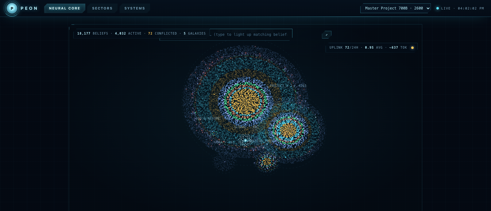
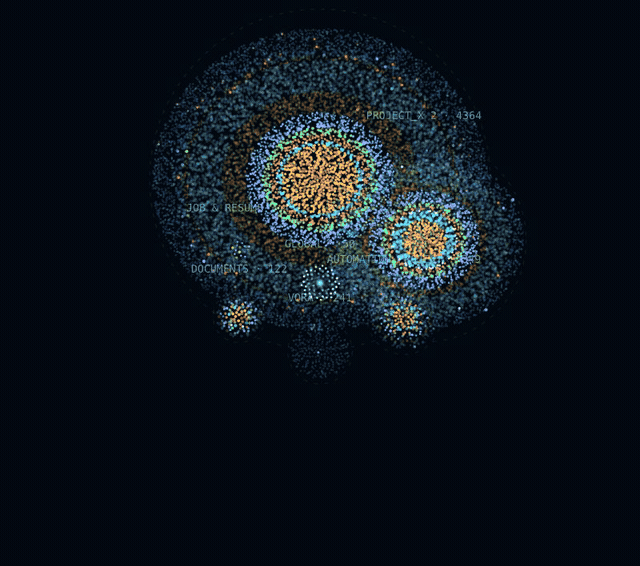

# 🧠 Peon — a memory brain for your AI coding agents

[](https://www.npmjs.com/package/peon-mem) [](LICENSE) [](test/)

**Local-first, hierarchical, self-improving memory for Claude Code, Codex, and any MCP client.**

Your AI forgets everything between sessions. Peon doesn't. It records your sessions, consolidates
them into typed *beliefs* with an LLM, and injects the relevant ones back into every prompt —
automatically, from a daemon that never leaves your machine.

```
        PEON GLOBAL BRAIN            ← user-level facts & preferences, inherited everywhere
       /        |         \
  project A  project B  project C    ← rooted child brains (.peon/ in each project)
```

## Why Peon

- **Hierarchical brains** — one global parent brain (who you are, your rules, your tools) plus an
  isolated child brain per project. Every injection = project memory + inherited global memory.
- **Two memory layers, honestly measured** — consolidated *beliefs* (decisions, preferences, facts,
  artifacts…) for gist, plus an *episodic* verbatim layer that recovers exact details lossy
  summaries drop (measured on LongMemEval: raw-episodic recall 61% vs belief-only 17%).
- **Auto capture + auto injection** — Claude Code hooks record messages/events and inject a
  query-ranked memory block (with an `⚠ MOST RELEVANT` headline) into every prompt. Zero effort.
- **Cost-gated consolidation** — an LLM distills sessions into beliefs only when enough new
  memory accumulates. Supersede / merge / conflict-detect; nothing is destructively deleted.
- **Hybrid retrieval** — lexical + semantic RRF fusion, MMR diversity, reinforcement, recency;
  query-embedding cache (persisted) so repeat prompts cost nothing.
- **The Neural Universe** — a live monitor at `localhost:3737/monitor` that renders every belief
  as a star: projects are galaxies, search makes matches flare, autonomous curation pulses.
- **A daily self-improvement loop (STL)** — Peon audits itself every day: what it recorded,
  injected, what failed, what consolidation did — and files a report with a verdict.
- **Eval-gated development** — a committed results ledger (git SHA + qrels + brain fingerprint per
  row) so retrieval changes are *proven*, not asserted. Negative results stay documented.
- **Local-first & locked down** — plain JSONL you can read, loopback-only daemon with
  DNS-rebinding protection, secret redaction at the injection boundary, path-traversal guards.



*The live monitor: 18k real beliefs rendered as stars. Type to make matching beliefs flare; click one to inspect it.*


*Ask the field: typing "wulver cluster" makes 400+ matching beliefs flare while the rest dim, and the camera flies to them.*

## Why "Peon"?

The name comes from Indian offices. Every office had a **peon** — the person who walked desk to
desk all day: collect a file from this table, note who needs what, carry it to the next table,
remember where everything is. Not the boss, not the star — but the one person the whole office
quietly ran on. Nothing moved without him, and he never forgot where anything was.

That's exactly this framework, with AI. Peon walks between your sessions and your projects —
collects what happened at one desk (a session), files it in the right cabinet (a project brain),
carries the relevant papers to the next desk before you ask (injection), and keeps the master
ledger upstairs (the global brain). Quiet clerk. Perfect memory. The office runs on him.

## How Peon differs from existing memory tools

| | **Peon** | mem0 | Letta/MemGPT | Zep/Graphiti | flat memory files (MEMORY.md) |
|---|---|---|---|---|---|
| Runs | **100% local daemon** | cloud or self-host | server | cloud/server | local |
| Storage | human-readable JSONL you can `cat` | vector DB | DB | graph DB | markdown |
| Memory model | **beliefs + verbatim episodic layer** | extracted facts | self-edited blocks | temporal knowledge graph | prose |
| Hierarchy | **global parent brain → per-project child brains, inherited on every prompt** | user/agent/session scopes | per-agent | per-user | per-project file |
| Capture | **automatic via hooks** (zero effort) | SDK calls you write | agent-managed | SDK calls | agent must remember to write |
| Conflict handling | supersede/merge, **recoverable — never hard-deletes** | LLM may DELETE | self-edit | invalidation | overwrite |
| Exact recall | episodic layer regression-tested (61% vs 17% belief-only, LongMemEval) | gist only | gist only | graph facts | whatever was written |
| Observability | **live Neural Universe monitor + daily self-audit (STL) + serve telemetry** | dashboard | — | — | — |
| Verification | **committed eval ledger; negative results kept** | vendor benchmarks | — | vendor benchmarks | — |

Positioning in one line: mem0/Zep are memory **platforms for products you build**; Peon is a
memory **brain for the coding agents you already use** — plug into Claude Code/Codex in five
minutes, watch it think, audit every number.

## Quickstart

Requirements: Node 20+, macOS or Linux. An [OpenRouter](https://openrouter.ai) API key is
recommended (consolidation + semantic embeddings); without one Peon still works lexical-only.

One line:

```bash
npm install -g peon-mem && peon-mem install
```

(no Node? `curl -fsSL https://raw.githubusercontent.com/VineetV2/peon-mem/main/install.sh | bash`)

The guided setup asks four things:

1. **Where your global brain lives** (default: `~/Library/Application Support/Peon`)
2. **Which LLM** — OpenRouter (one key, any model) · OpenAI · Anthropic · **Ollama (100% local & free)** · or skip
3. Installs the **daemon** as an auto-start service
4. **Detects your AI apps** and wires the MCP server (+ hooks for Claude Code) into the ones you
   pick — auto-configured: Claude Code, Claude Desktop, Codex, Gemini CLI, Cursor, Windsurf,
   VS Code (Copilot MCP), Zed, LM Studio; detected with in-app instructions: ChatGPT Desktop,
   Perplexity Desktop. Every touched config gets a `.peon-backup`.

That builds the package, starts the daemon as a service, wires your Claude Code hooks + MCP
server (with a backup of your settings), and writes a config template. Then add your key to
`~/Library/Application Support/Peon/.env` and open the monitor. `peon-mem install --dry-run`
shows every action first; `peon-mem uninstall` reverses it (memory data is never touched).

Or manually:

```bash
git clone https://github.com/VineetV2/peon-mem && cd peon-mem
npm install && npm run build
node bin/peon-mem.mjs install --dry-run   # inspect, then run without --dry-run
```

Create `.env` in the repo root:

```bash
OPENROUTER_API_KEY=sk-or-...
PEON_PROCESSING_MODEL=google/gemini-2.5-flash-lite   # cheap + good enough (measured)
PEON_EMBEDDING_MODEL=openai/text-embedding-3-small
```

Start the daemon (the installer prints a launchd/systemd recipe, or just):

```bash
node dist/daemon-cli.js              # serves 127.0.0.1:3737
```

Then wire your agent (the installer prints these filled in for your paths):

- **Claude Code** — add the hook to `~/.claude/settings.json` (SessionStart / UserPromptSubmit /
  SessionEnd → `scripts/claude-peon-hook.mjs`) and the MCP server (`dist/index.js`).
- **Codex / any MCP client** — register `dist/index.js` as a stdio MCP server; 16 tools
  (`start_session`, `get_context`, `search_memory`, `record_message`, `process_memory`, …).

Open `http://127.0.0.1:3737/monitor` and watch your brain grow.

## How it works

1. **Record** — hooks stream messages/events/tool-calls into `<project>/.peon/raw/` (append-only).
2. **Consolidate** — past a size gate, an LLM turns the session delta into typed belief records in
   `.peon/brain/memories.jsonl` (importance/confidence scores, entities, provenance pointers),
   reconciling against existing beliefs: supersede, merge, conflict-flag. Recoverable, never deleted.
3. **Retrieve + inject** — on every prompt, beliefs are ranked (RRF lexical+semantic, MMR,
   reinforcement) and injected alongside episodic verbatim matches and inherited global beliefs.
4. **Self-curate** — a background brain pass reinforces recalled beliefs, compresses stale
   clusters, resolves duplicates — every action logged and undoable.
5. **Self-audit (STL)** — a daily job reports: recorded / injected / went-wrong / consolidation
   correctness, with serve-latency telemetry and a health verdict.


## Full install (copy-paste)

### 1. Daemon (always-on, macOS launchd)

```bash
node scripts/install-peon.mjs           # prints everything below filled in for YOUR paths
```

Or manually — `~/Library/LaunchAgents/com.peon.daemon.plist`:

```xml
<?xml version="1.0" encoding="UTF-8"?>
<!DOCTYPE plist PUBLIC "-//Apple//DTD PLIST 1.0//EN" "http://www.apple.com/DTDs/PropertyList-1.0.dtd">
<plist version="1.0"><dict>
  <key>Label</key><string>com.peon.daemon</string>
  <key>ProgramArguments</key><array>
    <string>/opt/homebrew/bin/node</string>
    <string>/ABSOLUTE/PATH/TO/peon/dist/daemon-cli.js</string>
  </array>
  <key>RunAtLoad</key><true/>
  <key>KeepAlive</key><true/>
</dict></plist>
```

```bash
launchctl load ~/Library/LaunchAgents/com.peon.daemon.plist
curl http://127.0.0.1:3737/health        # → {"ok":true}
```

Linux: run `node dist/daemon-cli.js` under systemd (`Restart=always`).

### 2. Claude Code — hooks (auto capture + injection)

Merge into `~/.claude/settings.json` (replace the path):

```json
{
  "hooks": {
    "SessionStart": [{ "hooks": [{ "type": "command",
      "command": "node /ABSOLUTE/PATH/TO/peon/scripts/claude-peon-hook.mjs" }] }],
    "UserPromptSubmit": [{ "hooks": [{ "type": "command",
      "command": "node /ABSOLUTE/PATH/TO/peon/scripts/claude-peon-hook.mjs" }] }],
    "SessionEnd": [{ "hooks": [{ "type": "command",
      "command": "node /ABSOLUTE/PATH/TO/peon/scripts/claude-peon-hook.mjs" }] }]
  }
}
```

### 3. Claude Code — MCP server (search/inspect tools)

```bash
claude mcp add peon -- node /ABSOLUTE/PATH/TO/peon/dist/index.js
```

### 4. Codex / any MCP client

`~/.codex/config.toml`:

```toml
[mcp_servers.peon]
command = "node"
args = ["/ABSOLUTE/PATH/TO/peon/dist/index.js"]
[mcp_servers.peon.env]
PEON_DAEMON_URL = "http://127.0.0.1:3737"
```

Codex has no hooks — add usage rules to `~/.codex/AGENTS.md` telling it to call
`start_session` + `get_context` at session start and `record_message` for durable facts
(example block in [docs/](docs/)).

### 5. Verify

```bash
curl "http://127.0.0.1:3737/context?projectPath=$PWD&query=test"   # JSON context
open http://127.0.0.1:3737/monitor                                  # the Neural Universe
```

Start a Claude Code session in any project, say something decision-shaped, end the session —
within a minute the monitor shows the belief. Next session injects it.

### MCP tools exposed

`start_session` · `record_message` · `record_event` · `end_session` · `get_context` ·
`search_memory` · `inspect_brain` · `build_injection` · `query_projects` (cross-project search) ·
`quality_report` · `remember_global` · `search_global_memory` · `import_global_memory` ·
`evaluate_project` · `process_memory` · `maybe_process_memory`

### Uninstall

```bash
launchctl unload ~/Library/LaunchAgents/com.peon.daemon.plist
# remove the hook entries + MCP server from your agent config
# your memory stays in <project>/.peon/ and ~/Library/Application\ Support/Peon/ — plain files, delete when ready
```

## Troubleshooting / FAQ

- **No injection appearing?** `curl http://127.0.0.1:3737/health`; check hook is registered
  (`claude` → run any prompt → monitor Systems page shows the request).
- **431 errors on huge prompts?** Handled — the hook caps the retrieval query at 2k chars.
- **No OpenRouter key?** Everything still runs; retrieval is lexical + episodic only
  (semantic ranking and consolidation need a model). `PEON_EMBEDDING_MODE=ollama` works too.
- **Cost?** Consolidation is gated (default: fires per ~6k new chars, ~cents/day with
  flash-lite). Query embeddings are cached to disk — repeats are free.
- **Multiple machines?** Brains are plain files in your repos — commit `.peon/` if you want
  memory to travel (redact first: raw layer contains session text).
- **Is my data sent anywhere?** Only consolidation/embedding calls to your configured model
  provider. No telemetry, no cloud store. Daemon rejects non-loopback callers.

## Configuration (env)

| Var | Default | Purpose |
|---|---|---|
| `OPENROUTER_API_KEY` | — | consolidation + embeddings |
| `PEON_PROCESSING_MODEL` | `google/gemini-2.5-flash-lite` | consolidation model |
| `PEON_EMBEDDING_MODE` | auto | `api` / `ollama` / `local` / `off` |
| `PEON_EMBEDDING_MODEL` | — | e.g. `openai/text-embedding-3-small` or an Ollama model |
| `PEON_OLLAMA_URL` | `http://127.0.0.1:11434` | local embedding server |
| `PEON_AI_MODE` | `gated` | `off` disables all LLM calls |
| `PEON_FLUSH_MIN_CHARS` | `6000` | consolidation cost gate |
| `PEON_MEMORY_DIR` | `.peon` | per-project brain dir name |
| `PEON_DAEMON_URL` | `http://127.0.0.1:3737` | daemon address |
| `PEON_CONSOLIDATION_MAX_DELTA_CHARS` | `60000` | anti truncation-stall chunking |
| `PEON_DISABLED` | — | hard off-switch for A/B testing |

## Project brains

- A brain lives in `<project>/.peon/` — human-readable JSONL + markdown. Commit it or ignore it;
  your choice (`.gitignore` ships ignoring it).
- `.peon/root` marks a brain boundary. New brains are born rooted; a parent directory can never
  swallow a project's memory.
- The global brain lives in `~/Library/Application Support/Peon/global/` (macOS).

## Using Peon with NO AI at all

Some people want a memory system that never calls a model — no API keys, no local LLM, no
embeddings, fully deterministic. Peon supports that as a first-class mode: pick **skip** in the
install wizard, or set two env vars in `<memory-home>/.env`:

```
PEON_AI_MODE=off
PEON_EMBEDDING_MODE=off
```

**What still works (all of it deterministic code, no model anywhere):**

- **Capture** — hooks record every prompt, tool call, and session event to plain JSONL in
  `<project>/.peon/raw/`.
- **Real-time brain files** — decisions, preferences, open questions, and artifacts are written
  live to readable `.md` files by rule-based extraction as events arrive.
- **Injection** — session-start context comes from those real-time files, query-focused and
  budgeted, same as always.
- **Search** — lexical retrieval (RRF over keyword rank + recency + importance + type priors).
  No embeddings needed; this is the same degrade path the semantic stack falls back to.
- **Episodic recall** — verbatim what-was-said lookup is lexical by design, so it is unaffected.
- **Monitor UI, token tracking, cross-project search, backups** — all model-free.

**What you give up:** consolidation (raw events are never distilled into deduplicated beliefs —
memory grows as an append-only journal), semantic search (paraphrased queries need shared
keywords), automatic entity extraction, and stale-shadow demotion (it compares embeddings).

**Two escape hatches if you want curation without external AI:**

1. `process_memory` accepts a pre-built `aiResult` — the coding agent you already run (Claude
   Code, Codex) can do the distillation itself in-session and hand Peon the structured result.
   Memory stays curated, and Peon itself never spends a token.
2. Everything is plain JSONL/Markdown on disk — you can edit beliefs by hand or through the
   monitor's memory endpoints. Peon backs up before every mutation.

## Measured: does memory actually save tokens?

A/B test, real `claude -p` sessions, one question per session, same repo, same model. ON = Peon
hooks active (memory injected at session start), OFF = `PEON_DISABLED=1` (agent falls back to
reading files). 20 questions across procedures, past results, decisions, and current-state facts;
15 clean ON/OFF pairs survived tooling issues. Token counts read from Claude Code's own
session transcripts.

| paired, n=15/arm | ON (Peon) | OFF | delta |
|---|---|---|---|
| avg tokens (in+out) | **511** | 878 | **−42%** |
| median tokens | **225** | 1,048 | **−79%** |
| cache-read tokens | 81.6k | 110.5k | 1.35× less |
| cheaper arm | **ON wins 12/15** | | |

Answer quality (graded against repo ground truth): 8 ties, 1 clear Peon win, 5 baseline wins,
1 both-weak. The Peon win is the interesting one: a rule that was only ever stated in a
conversation (a professor's citation policy from an email) — the baseline answered *"no such
rule found"*, Peon recited it exactly. Conversation-borne knowledge has no file to grep.

Honest caveats: the test repo has unusually good docs (a maintained research log), which makes
the baseline strong — most repos aren't like that; n=15 is small; questions were picked to have
known answers, not sampled from real usage. Two weaknesses this test exposed — a stale
superseded belief outranking the newer truth, and token rows lost when consolidation outlived
the hook timeout — are both fixed (stale-shadow demotion at retrieval; usage logged before
consolidation).

## Honesty section

Peon's development is eval-gated and keeps its negative results: an associative entity graph was
built, measured (−2.9% Recall@10), and turned OFF by default. Consolidation is lossy by design —
that's why the episodic layer exists and is regression-tested. The eval harness + committed
ledger (`npm run eval`) let you verify retrieval changes on your own brain.

## Security

- Daemon binds `127.0.0.1` only and rejects non-loopback `Host`/`Origin` (DNS-rebinding defense).
- Secrets (API keys, tokens, JWTs) are redacted at the injection boundary.
- Path-traversal guarded; per-project write locks; atomic tmp+rename writes; automatic backups
  before destructive-adjacent operations. Nothing is hard-deleted.

## License

MIT © Vineet Vora

## Contributing — I'd love your help

Peon is built and maintained by one person, and I'm genuinely open to help making it better.
If any of this sounds interesting, jump in — issues, PRs, ideas, criticism of the architecture,
or just telling me where it broke on your machine. No contribution is too small.

**Where help would matter most right now:**

- **Windows & Linux support** — the daemon install is macOS launchd today; systemd/Task
  Scheduler equivalents need real users to test them.
- **More agent integrations** — the wizard covers 11 apps; hooks-level capture (like the
  Claude Code integration) for Codex, Cursor, and others would make memory richer everywhere.
- **Retrieval quality** — the eval harness (`npm run eval`) makes experiments cheap: better
  consolidation prompts, smarter staleness handling, local embedding models worth defaulting to.
- **Benchmarks** — run the token A/B on YOUR repo and share the numbers, especially where Peon
  loses. Negative results are first-class here.
- **Docs & onboarding** — if the README or wizard confused you, that confusion is a bug report.

**How:** open an issue at [github.com/VineetV2/peon-mem/issues](https://github.com/VineetV2/peon-mem/issues)
or send a PR directly.

Rules of the house: every retrieval/quality change ships with a test and an eval-ledger run
(`npm run eval`); negative results get documented, not deleted; nothing may hard-delete user
memory. `npm test` must stay green.
